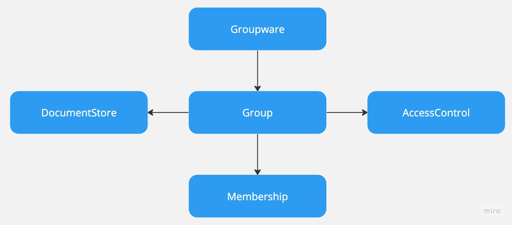

# groupware

Groupware application

## Description

Groupware is a decentralized application that allows users to collaborate on documents, share files, manage projects, schedule meetings, and more.

All information is stored in the blockchain, and the application is accessible via a web interface. 

---

## Contracts

### Groupware contract

`Groupware` contract is the main contract of the groupware application, it is the entry point of the application.

### Group contract

`Group` contract store group information, called by the `Groupware` contract.

### DocumentStore contract 

`DocumentStore` contract store documents, called by the `Groupware` contract.

### AccessControl contract 

`AccessControl` contract control access to documents and group information, called by the `Groupware` contract.

### Membership contract

`Membership` contract store membership information, called by the `Groupware` contract.

---

## TODO 

### API

- [ ] Document
  - [ ] Handler
  - [ ] Service
- [ ] Group
  - [ ] Handler
  - [ ] Service
- [ ] Member
  - [ ] Handler
  - [ ] Service
- [ ] Message
  - [ ] Handler
  - [ ] Service
- [ ] Role
  - [ ] Handler
  - [ ] Service
- [ ] User
  - [ ] Handler
  - [ ] Service